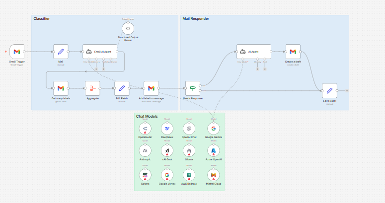

# n8n-email-ai-agent

AI-powered Gmail email triage and response workflow built with **n8n**.  
Automatically classifies incoming Gmail emails, applies the correct labels, and drafts smart AI-generated replies when a response is required. Supports multiple AI models, allowing you to choose the one that fits your needs.

## Features

- **Gmail Trigger:** Monitors your inbox for new emails.
- **AI Email Classification:** Classifies emails using a strict, structured labeling system.
- **Multiple AI Models:** Choose from multiple supported chat models inside the workflow.
- **Automated Gmail Labeling:** Applies labels automatically based on AI classification.
- **AI Drafted Responses:** Drafts reply emails when a response is required.
- **Fully Customizable:** Labels, prompts, and models can all be adapted to your needs.

## Default Classification Labels

By default, the workflow uses the following labels **exactly as written**:

- `1: To respond`
- `2: FYI`
- `3: Comment`
- `4: Notification`
- `5: Meeting Update`
- `6: Awaiting reply`
- `7: Collab Request`
- `8: Marketing`
- `9: Cold Email`

⚠️ **Important:**  
You must create these labels manually in your Gmail account **before activating the workflow**, or the labeling step will fail.

If you prefer different labels, you can update the **system prompt** in the Email AI Agent node to match your own labeling scheme.

## Setup Instructions

### 1. Import the Workflow
- Download the workflow JSON from `workflow/email-ai-agent.json`
- In n8n, go to **Workflows → Import → JSON**
- Import the file

### 2. Configure Credentials
- **Gmail OAuth2**: Required to read emails, fetch labels, and apply labels
- **AI Models**: Configure credentials for the AI models you want to use (e.g. Google Gemini or others included in the workflow)
- Ensure no API keys or secrets are committed to the repository

### 3. Create Gmail Labels
- Create the default labels listed above in Gmail  
  **OR**
- Customize the system prompt to use your own labels and naming conventions

### 4. Activate the Workflow
- Activate the workflow in n8n
- New incoming emails will now be processed automatically

## How It Works

1. A new email arrives in Gmail
2. The AI agent classifies the email into exactly one label
3. The corresponding Gmail label is applied
4. If the email requires a response:
   - An AI-generated draft reply is created
5. You review and send the draft manually

## Customization

- **Change Labels:** Edit the system prompt to define your own labels
- **Switch AI Models:** Enable or disable models and route the agent to your preferred one
- **Adjust Confidence Rules:** Modify confidence thresholds or fallback behavior
- **Extend the Workflow:** Add Slack, Notion, or webhook integrations

## Screenshots

## License

This project is licensed under the **MIT License**. See the [LICENSE](LICENSE) file for details.

## Support

If you face any issues or have questions about this workflow, feel free to contact me at **contact@dnnengineer.com** or **alamzweb@gmail.com**.

---

**Disclaimer:**  
This workflow drafts responses using AI. Always review generated drafts before sending.
